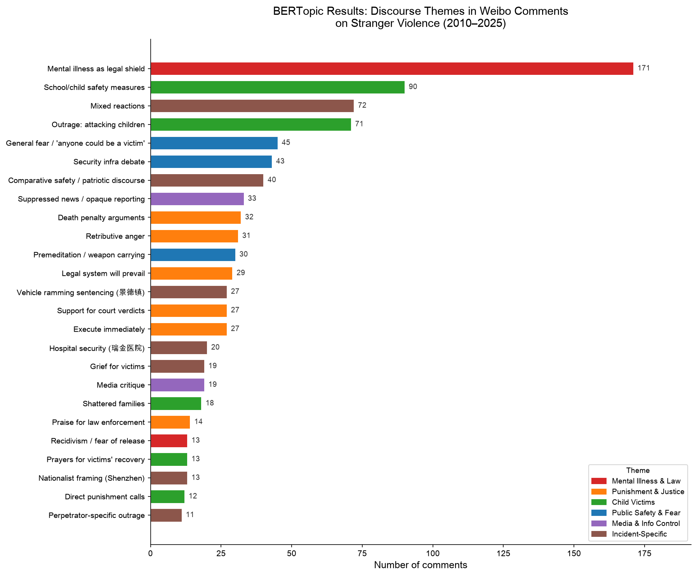
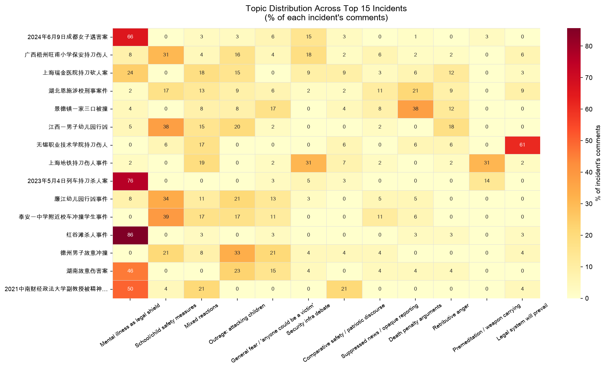
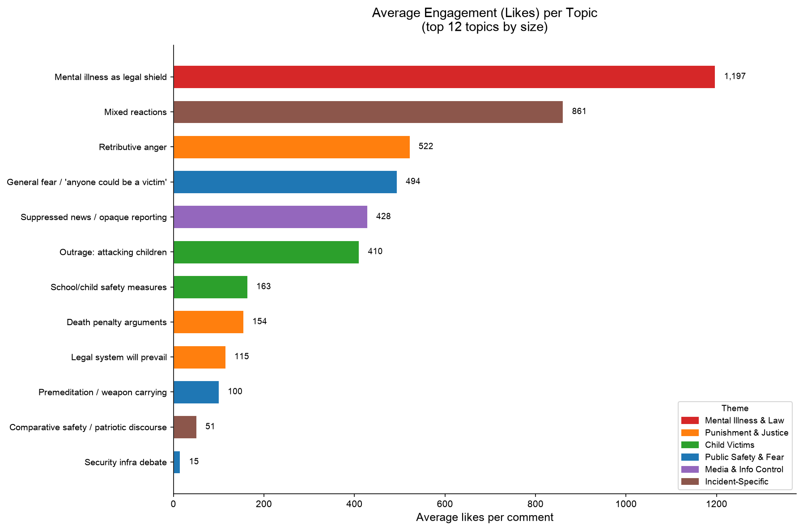

# BERTopic Analysis
**Data:** 2,188 comments across 35 incidents (2010–2025), scraped from Weibo  
**Method:** BERTopic with `paraphrase-multilingual-MiniLM-L12-v2` sentence embeddings  

## Overview

| | |
|---|---|
| Comments analyzed | 1,265 (after filtering < 8 characters) |
| Topics found | 25 |
| Outlier / unclustered comments | 345 |

The 25 topics cluster into **6 higher-level discourse themes**. 

## Theme 1: Mental Illness & Legal Accountability 

### Topic 0 — "Mental illness is not a get-out-of-jail-free card" (171 comments)
**Top keywords:** 精神病不是免死金牌 · 精神病 · 精神病在没发病的情况下

Representative comments (ranked by likes):

> **[66,290 likes | 红谷滩杀人事件]**  
> 希望精神病不是挡箭牌  
> *"Hope mental illness is not used as a shield"*

> **[29,440 likes | 成都女子遇害案]**  
> 阿姨，我爸爸也是被精神病杀死的，我支持你！如果判不了死刑，我们受害人算什么！我们老老实实本本分分的生活，到头来被精神病毁了一家他们却不用付出代价！凭什么！  
> *"My father was also killed by someone with mental illness. If there's no death penalty, what are we victims worth? We live honestly and our family gets destroyed — why do they get to pay no price?"*

> **[26,336 likes | 红谷滩杀人事件]**  
> 精神病杀人的，是不是要重新考虑量刑，都治不好，还会继续杀人，安乐死算了。  
> *"For those with mental illness who kill — should we rethink sentencing? They can't be cured and will keep killing. Euthanasia might as well be the answer."*

> **[18,782 likes | 红谷滩杀人事件]**  
> 一出事就是精神病，精神尼玛啊！  
> *"Every incident and suddenly it's mental illness — bullsh*t!"*

> **[13,257 likes | 红谷滩杀人事件]**  
> 无辜的人惨死，精神病人逍遥。这事现在太频繁了吧。要死多少人政府才能下重手整治  
> *"Innocent people die horribly while the mentally ill go free. This is happening too often. How many people must die before the government cracks down?"*

---

### Topic 20 — Recidivism / fear of release (13 comments)

> **[3,491 likes | 广州宝马撞人案]**  
> 这个算是判的快的了，很多都要等两三年。  
> *"This verdict was actually fast — many take two or three years."*

> **[44 likes | 列车持刀杀人案]**  
> 是不是应该终生强制医疗？否则别过两年说好了就给放出来了  
> *"Should it be mandatory lifelong psychiatric custody? Otherwise in two years they'll say he's better and let him out."*

## Theme 2: Demands for Punishment & Justice

### Topic 8 — Death penalty debate (32 comments)
**Top keywords:** 惩罚不可饶恕之罪 · 便是死刑存在的意义 · 主观恶意程度

> **[2,365 likes | 红谷滩杀人事件]**  
> 死刑就是最好的治疗！  
> *"The death penalty is the best treatment!"*

> **[2,078 likes | 景德镇一家三口被撞]**  
> 为啥不是死刑呢？不是杀人偿命吗  
> *"Why isn't it the death penalty? Isn't it life for a life?"*

### Topic 9 — Retributive anger (31 comments)
**Top keywords:** 这种人永远只会找弱小下手 · 这种人必须重判

> **[1,966 likes | 红谷滩杀人事件]**  
> 凭什么他脑袋有问题要别人付出代价？这是对正常人很大的不公啊！  
> *"Why should his mental problems mean others pay the price? This is deeply unjust to ordinary people."*

### Topic 11 — Trust in legal system (29 comments)
**Top keywords:** 法网恢恢 · 疏而不漏 · 正义不会迟到

### Topic 12 — Support for verdicts (27 comments)
**Top keywords:** 支持法院判决 · 罪有应得 · 正义不会缺席

### Topic 19 — Praise for law enforcement (14 comments)
**Top keywords:** 政法机关办得快 · 办得好 · 点赞

> *Note: Topics 11, 12, 19 are predominantly state media-aligned boilerplate comments, in contrast to the organic outrage in Topics 8 and 9.*

## Theme 3: Child Victims & Vulnerability

### Topic 1 — School safety measures (90 comments)
**Top keywords:** 小学 · 希望国家加强对小孩的保护措施 · 保安呢

> **[4,613 likes | 江西幼儿园行凶]**  
> 幼儿园怎么进去的！！保安呢？？  
> *"How did he get into the kindergarten?! Where was security??"*

> **[2,741 likes | 廉江幼儿园行凶]**  
> 天啊，专门欺负弱者，选幼儿园！！！！  
> *"My god — targeting the weakest, choosing a kindergarten!"*

### Topic 3 — Moral condemnation of attacking children (71 comments)
**Top keywords:** 畜牲啊 · 但这些孩子并没有错 · 无论生活怎么对不起你 · 对孩子下手

> **[8,311 likes | 廉江幼儿园行凶]**  
> 小孩子都杀，把他凌迟处死吧  
> *"Killing children — he deserves to be executed by a thousand cuts."*

### Topic 18 — Grief for shattered families (18 comments)

> **[16,430 likes | 江西幼儿园行凶]**  
> 多少个家庭支离破碎  
> *"How many families torn apart."*

## Theme 4: Public Safety & Fear

### Topic 4 — "Anyone could be a victim" (45 comments)
**Top keywords:** 社会缺少公平正义每个人都可能成为受害者 · 太危险啦

> **[20,194 likes | 廉江幼儿园行凶]**  
> 怎么老有人往压力大上扯，活不下去捅自己啊，害别人干嘛……  
> *"Why do people always blame 'social pressure'? If you can't go on, hurt yourself — why harm others?"*

### Topic 5 — Security infrastructure debate (40 comments)
**Top keywords:** 安检 · 保安干嘛去了 · 保安一点用都没有

> **[63 likes | 上海地铁持刀伤人]**  
> 知道安检的重要性了吧，谁那几天说安检不好  
> *"Now you know why security checks matter — where are the people who said they weren't needed?"*

### Topic 10 — Premeditation / weapon carrying (30 comments)
**Top keywords:** 不然为啥随身带刀 · 肯定是计划好的 · 刀怎么带上火车的

> **[675 likes | 列车持刀杀人案]**  
> 刀怎么带上火车的！！！  
> *"How did he get a knife onto the train?!"*

## Theme 5: Media & Information Control

### Topic 7 — Suppression / opaque reporting (33 comments)
**Top keywords:** 不清不楚的通报 · 压得真好 · 马利弊新闻都看不到

> **[11,168 likes | 景德镇一家三口被撞]**  
> 一言难尽，很不舒畅。  
> *"Hard to put into words. Very unsettling."*

> **[166 likes | 上海松江男子超市持刀伤人]**  
> 刚才看到别的媒体报道，后来就没了，只剩凤凰了  
> *"Just saw coverage from other outlets, then it disappeared — only Phoenix TV left."*

> **[72 likes | 上海松江沃尔玛持刀伤人]**  
> 压得真好。这都不上热搜  
> *"Really well suppressed. This didn't even trend."*

### Topic 17 — Media critique (19 comments)

> **[285 likes | 上海松江男子超市持刀伤人]**  
> 这种事发生太多了，每次就是个警情通报，从不分析这背后的真相和原因。  
> *"This happens too often. Every time it's just a police bulletin — never any analysis of the truth or cause."*

## Theme 6: Incident-Specific Discourse

### Topic 22 — Nationalist framing (13 comments) — *Shenzhen Japanese school stabbing only*
**Top keywords:** 日本人应该好好反省下 · 是不是受韩国情报机构指示

> *This topic is entirely concentrated on the 2024 Shenzhen incident involving a Japanese child. Comments deflect blame toward Japan rather than discussing the perpetrator's mental state.*

### Topic 14 — Vehicle ramming sentencing (27 comments) — *景德镇 case*
**Top keywords:** 飙车致三死案 · 根本没悔意

### Topic 15 — Hospital security (20 comments) — *瑞金医院 case*
**Top keywords:** 延误治疗时间 · 医院门口金属探测

## Figures

### Figure 1 — Topic Sizes

Horizontal bar chart of all 25 topics by comment count, color-coded by the 6 discourse themes. Topic 0 ("Mental illness as legal shield") is the largest topic by a wide margin (171 comments), nearly double the next largest topic (school/child safety, 90 comments).

---

### Figure 2 — Topic Distribution Across Top 15 Incidents

Each row is an incident; each column is one of the top 12 topics. Cell values show what percentage of that incident's comments fall into each topic. Key patterns:
- **红谷滩杀人事件** and **成都女子遇害案** are heavily dominated by the mental illness topic (80%+).
- **江西幼儿园** and **廉江幼儿园** cluster into child victim topics (Topics 1, 3).
- **景德镇** and **瑞金医院** show distinct single-incident topics (Topics 14, 15).

---

### Figure 3 — Average Engagement (Likes) per Topic

Average likes per comment for the 12 largest topics. The mental illness topic averages **1,197 likes per comment** — far exceeding all others. Even the second-highest topic (mixed reactions, ~861 avg likes) is a distant runner-up. This confirms that mental illness framing is not only the most common discourse but also the most publicly resonant.
